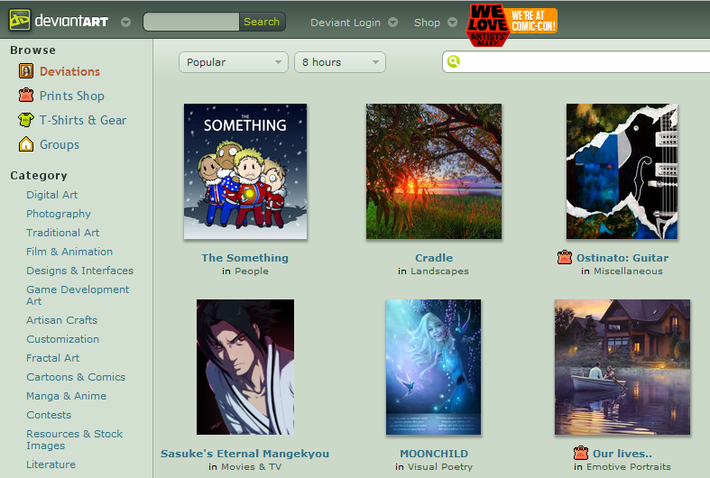

# _**Qué es DeviantArt?🖌️**_

Es un sitio web donde artistas gráficos y audiovisuales pueden compartir sus trabajos, interactuar, participar de concursos y darse a conocer al mundo, desde el año 2000. En esta pagina web podemos encontrar millones de creaciones de artistas, esas creaciones puden ser fotos, dibujos digitales, pixelart, skins para videojuegos e incluso cosplays. Es una pagina que fue lanzada el año 2000, siendo filial de la empresa isreaeli "Wix.com", y que al dia de hoy sigue siendo muy usada.

La pagina consigio tanta popularidad que a dia de hoy tiene más de 61 millones de usarios registrados! 😲
